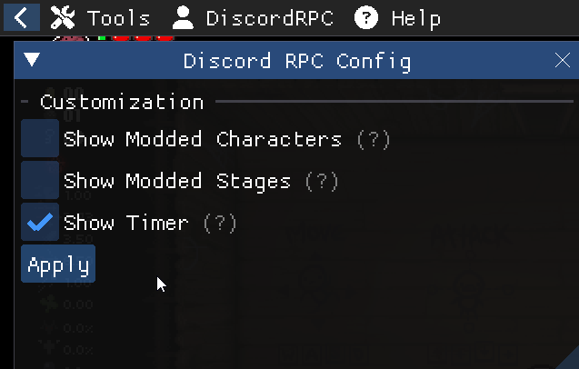

# Repentogon Discord Rich Presence
A DLL Mod for Repentogon that adds Discord rich presence to TBOI Repentance

[This mod requires Repentogon to run.](https://repentogon.com/)

## ⚠️ WARNING BEFORE DOWNLOADING ⚠️

### This is a DLL mod! For your safety, only download the mod off of this Github repository.
DLL mods have the same level of capability as any Lua mod does with the `--luadebug` launch parameter.

This means that DLL mods are ran without a sandboxed environment and can do anything they want to your PC. For your own safety, please be cautious about downloading mods that require you to add any `.dll` file to your game's directory. This repository by catinsurance is the only place you can download this mod.

## How to install

Head over to the [latest release here](https://github.com/catinsurance/Repentogon-Discord-Rich-Presence/releases), and install the `.zip` file under the Assets dropdown menu.

Then, unzip the file in your Isaac's root directory. **Not your mods folder!** The same directory/folder where your `isaac-ng.exe` resides. When updating, you can safely replace the old files with the new ones.

## How to uninstall

`zhlIsaacDiscord.dll` is the core of the mod, and deleting it will delete the mod and the code that loads the other files. If you'd like to fully uninstall, delete `zhlIsaacDiscord.dll`, `discord_game_sdk.dll` and `isaac-discord-scripts` in your game's root directory (where `isaac-ng.exe` resides).

If you'd like to delete the config file and any other save data, head over to where the game stores your save data (typically `Documents/My Games/Binding of Isaac Repentance/` on Windows), and delete the folder `DiscordRichPresence`. You can also find the mod's `options.ini` here, if you just wanted to edit it manually.

## Fun screenshots

